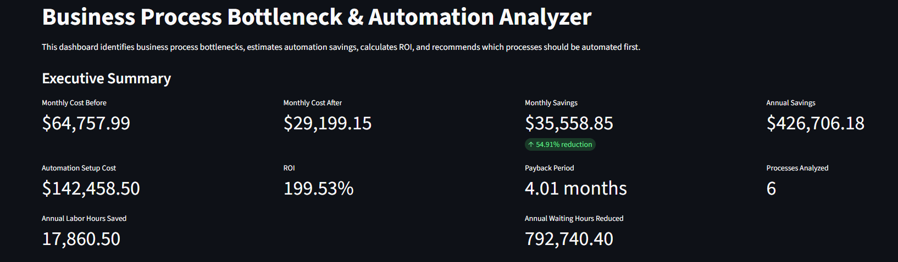
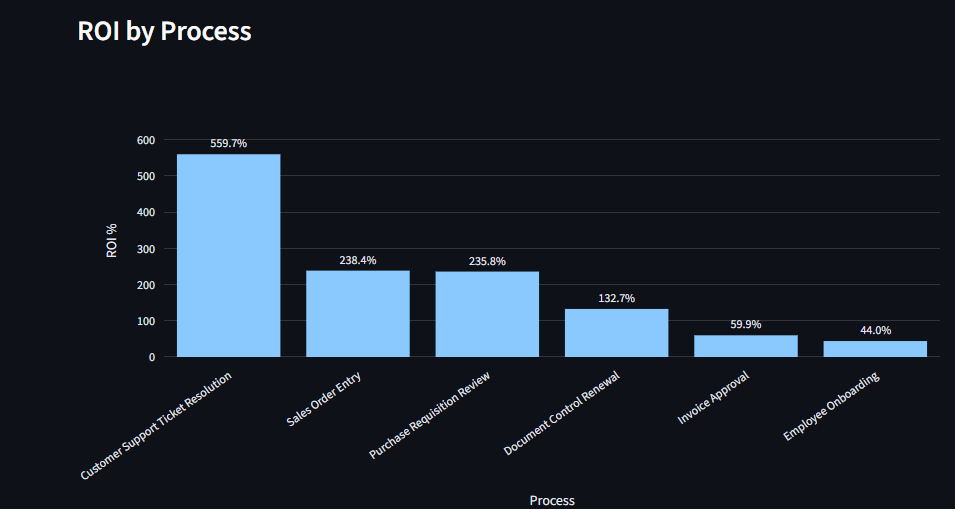
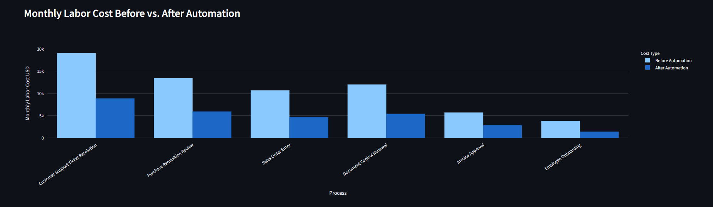
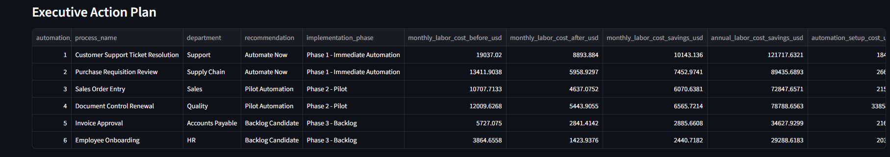
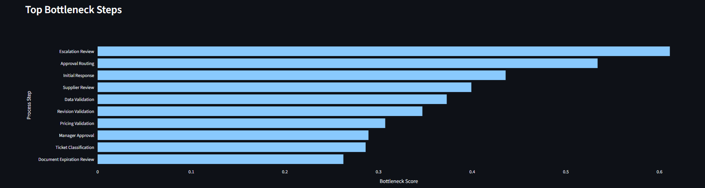

# Business Process Bottleneck & Automation Analyzer

## Overview

This project analyzes business processes to identify bottlenecks, operational inefficiencies, automation opportunities, and estimated financial savings.

The tool calculates the current time and cost of manual processes, estimates the future state after automation, and provides ROI-based recommendations to help businesses prioritize process improvement initiatives.

## Portfolio Demo Version

This repository is a portfolio demo version of a business process bottleneck and automation analysis tool.

It uses synthetic business process data to demonstrate how Python can be used to:

- Identify operational bottlenecks
- Estimate manual labor cost
- Compare before vs. after automation scenarios
- Calculate automation savings
- Estimate ROI and payback period
- Generate process improvement recommendations
- Display results in an interactive Streamlit dashboard

This public version does not include real company data, client data, private implementation playbooks, ERP integrations, commercial pricing models, or proprietary consulting materials.

## Data Privacy Notice

This project uses synthetic data only.

Do not upload:

- Real company data
- Real employee names
- Customer information
- Supplier information
- ERP exports
- SAP data
- Financial confidential data
- Internal process documentation

For real business implementation, data should be validated with process owners and handled according to company data security policies.

## Business Problem

Many small and mid-sized businesses rely on manual workflows, spreadsheets, emails, and disconnected systems. These processes often create delays, rework, duplicated effort, and hidden labor costs.

This project helps answer key operational questions:

- Which process is creating the biggest bottleneck?
- How much time is currently being lost?
- How much money is the business spending on manual work?
- Which processes should be automated first?
- What is the estimated monthly and annual savings?
- What is the expected ROI and payback period?

## Key Features

- Import business process data from CSV or Excel
- Calculate current manual time and labor cost
- Estimate future time and cost after automation
- Identify bottlenecks by time, cost, waiting hours, and error rate
- Rank automation opportunities
- Calculate monthly savings, annual savings, ROI, and payback period
- Generate executive-ready outputs
- Streamlit dashboard for interactive analysis

## Dashboard Preview

### Executive Summary



### ROI by Process



### Monthly Cost Before vs. After Automation



### Executive Action Plan



### Top Bottlenecks



## Business Impact

This project demonstrates how operational process data can be converted into actionable automation decisions.

The analyzer helps estimate:

- Current monthly labor cost before automation
- Future monthly labor cost after automation
- Monthly and annual labor savings
- Annual labor hours saved
- Waiting-time reduction
- Automation setup cost
- ROI percentage
- Payback period
- Recommended automation priority

The tool is designed to support better decision-making before investing in automation. Instead of automating based on assumptions, the business can prioritize opportunities based on cost, bottleneck severity, ROI, and payback speed.

## Skills Demonstrated

This project demonstrates skills in:

- Business process analysis
- Bottleneck identification
- ROI analysis
- Automation opportunity assessment
- Data validation
- Python programming
- Pandas data processing
- Streamlit dashboard development
- Plotly data visualization
- Modular project structure
- Executive reporting
- GitHub project documentation
- Business case development

## Project Workflow

The project follows a structured business analysis pipeline:

```text
1. Generate synthetic business process data
2. Validate and clean input data
3. Analyze current-state bottlenecks
4. Calculate before vs. after automation metrics
5. Estimate savings, ROI, and payback period
6. Generate automation recommendations
7. Display results in a Streamlit dashboard

The full pipeline can be executed with:

```bash
python src/run_pipeline.py
```

```md
## Key Business Formulas

### Manual Labor Hours Before Automation

```text
manual_hours_before = monthly_volume × manual_time_minutes_per_case / 60

rework_hours_before = monthly_volume × error_rate × rework_time_minutes_per_error / 60

labor_cost_before = (manual_hours_before + rework_hours_before) × cost_per_hour

monthly_savings = labor_cost_before - labor_cost_after

annual_savings = monthly_savings × 12

roi_pct = ((annual_savings - automation_setup_cost) / automation_setup_cost) × 100

payback_months = automation_setup_cost / monthly_savings

```md
## Limitations

This project uses synthetic data and estimated automation assumptions for demonstration purposes.

The results should not be interpreted as guaranteed savings.

A real business implementation would require:

- Validated process data
- Historical transaction volumes
- Accurate labor cost assumptions
- Process owner interviews
- Time studies
- Automation feasibility review
- Technical integration assessment
- Pilot testing
- Post-implementation measurement

The public version is intended for portfolio demonstration and educational review only.

## Future Enhancements

Potential future improvements include:

- Excel upload support
- Configurable ROI assumptions
- Scenario comparison
- PDF executive report generation
- Power BI export layer
- SQL database integration
- User-defined automation scoring weights
- Process owner input form
- Historical trend analysis
- Real implementation tracking after automation

## How to Run the Project

-Install dependencies:

```bash
pip install -r requirements.txt

-Run the full analysis pipeline:

python src/run_pipeline.py

-Launch the dashboard:

streamlit run src/app.py

## Generated Outputs

The pipeline creates several CSV outputs for analysis and reporting.

### Processed Data

```text
data/processed/business_process_data_clean.csv
data/processed/bottleneck_analysis_results.csv
data/processed/automation_roi_results.csv
```

### Reports

```text
reports/data_validation_summary.csv
reports/bottleneck_summary_by_process.csv
reports/top_bottlenecks.csv
reports/automation_roi_summary_by_process.csv
reports/executive_roi_summary.csv
reports/automation_recommendations_by_process.csv
reports/automation_recommendations_by_step.csv
reports/executive_action_plan.csv
```

## Real Business Implementation

This project can be adapted to real business environments by replacing the synthetic dataset with validated process data.

A real implementation would require:

- Process mapping
- Historical transaction volume
- Manual time studies
- Error and rework analysis
- Labor cost assumptions
- Automation cost estimates
- Process owner validation
- Pilot testing
- Post-implementation measurement

The public version is designed for demonstration and portfolio purposes. A production version would require additional controls, security, configuration, integrations, and business validation.

## Use Cases

This project can be adapted for:

- Procurement workflows
- Invoice approval
- Purchase requisitions
- Customer service tickets
- HR onboarding
- Document control
- Quality management processes
- Project management workflows
- Administrative operations

## Expected Business Impact

The analyzer compares the current state versus the future automated state.

Example output:

| Metric | Before Automation | After Automation |
|---|---:|---:|
| Monthly Manual Hours | 420 | 130 |
| Monthly Labor Cost | $8,400 | $2,600 |
| Monthly Savings | - | $5,800 |
| Annual Savings | - | $69,600 |
| Payback Period | - | 2.1 months |
| ROI | - | 480% |

## Tech Stack

- Python
- Pandas
- NumPy
- Streamlit
- Plotly
- OpenPyXL

## Project Structure

```text
business-process-bottleneck-automation-analyzer/
│
├── README.md
├── requirements.txt
├── data/
│   ├── raw/
│   └── processed/
├── reports/
├── src/
├── notebooks/
└── docs/

## Usage Notice

This repository is a public portfolio demo.

Commercial use, resale, client implementation, or consulting delivery based on this repository is not permitted without explicit written authorization.

See `NOTICE.md` for details.

## Documentation

- [Business Case](docs/business_case.md)
- [Data Dictionary](docs/data_dictionary.md)
- [Implementation Guide](docs/implementation_guide.md)
- [Project Case Study](docs/project_case_study.md)

## Status

In development.

## Maintainer

Repository owner.